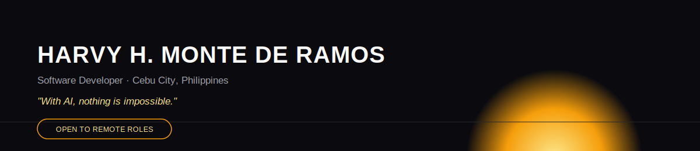
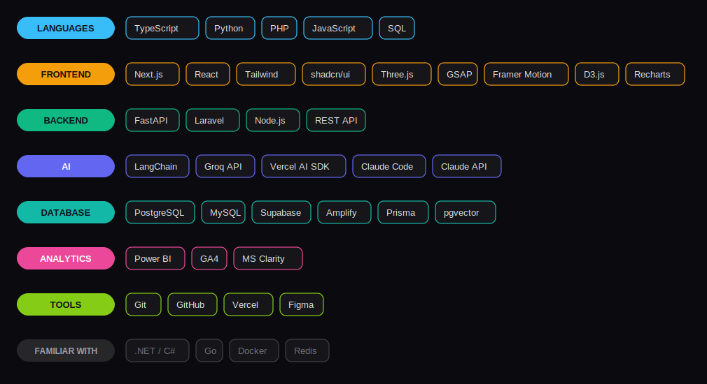
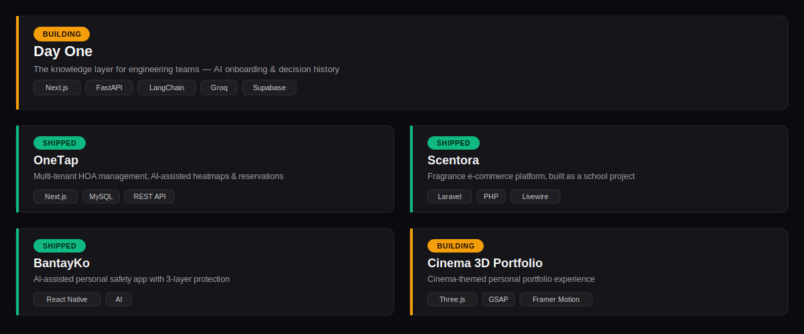
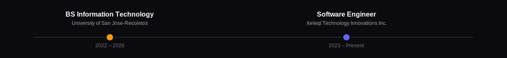
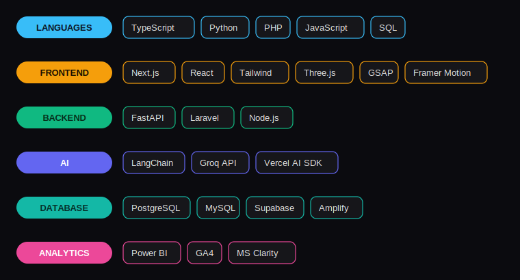

  

 

Software developer building full-stack web applications and AI-integrated tools. Background in AIoT systems. Currently building a B2B platform from scratch.

## Stack

  

## Projects

  

## Background

  

  

